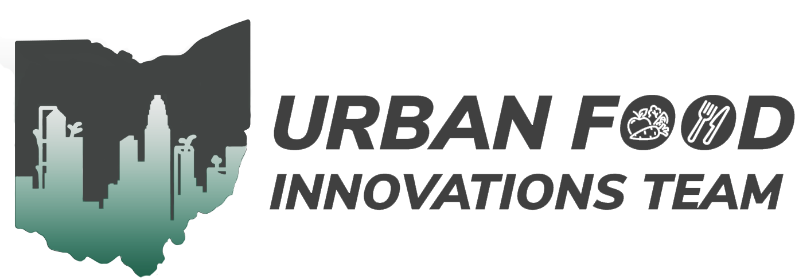

🌱🍎💡🍽️🌍 Hi! First, **welcome to the Urban Food Innovations Team!** 🌱🍎💡🍽️🌍

We greatly appreciate your interest and motivation to join us at The Ohio State University. Broadly, our team seeks to cultivate horticultural food production systems serving urban and regional markets that are productive and nutritive, resource-use efficient, economically viable, and socially responsible. By joining our team, you are committing to pursue research, perform quality experiments, and critically analyze data to further our knowledge about urban agriculture. In this role, you are committing to fostering and supporting your personal and professional growth to better meet your career and life goals however **you** define them.

Our team is passionate about building a more innovative local food system that embodies agroecological principles. We aim to achieve this through our shared values – 
treating others and ourselves with respect and empathy, as well as practicing curiosity and innovation. We seek to enable this through a work environment that includes 
**communication, proactivity, collaboration, and resourcefulness**.

If there is any questios, please contact us:

🐦 [Twitter|X](https://x.com/fernandakrupek)  
📧 E-mail: [Krupek.1@osu.edu](mailto:Krupek.1@osu.edu)  
